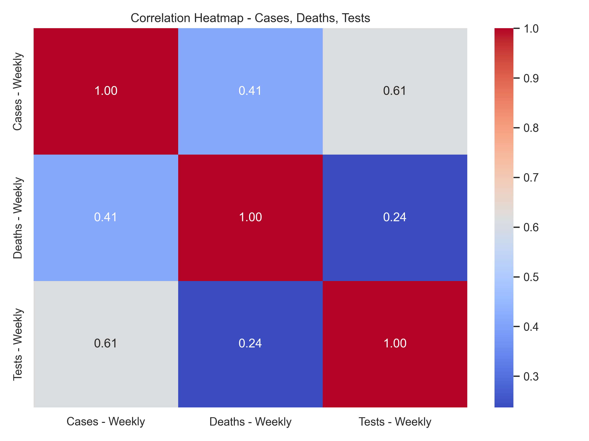

# 🦠 COVID-19 Data Analysis Project

This project performs a comprehensive data cleaning and analysis pipeline on ZIP code–level COVID-19 data. It covers everything from data preprocessing to visualization and statistical interpretation.

---

## 📁 Dataset Description

- ZIP Code–wise weekly data
- Includes: Weekly cases, deaths, tests, case rate, test rate, population, and spatial location
- Spatial field: `ZIP Code Location` → POINT (longitude latitude)

---

## Objectives Completed:

### ✅ Objective 1: Data Cleaning and Handling Missing Values
- Removed duplicates
- Median imputation for missing values

### ✅ Objective 2: Weekly COVID-19 Trend Analysis
- Line chart for weekly COVID-19 cases, deaths, and tests
- Stacked area chart to visualize comparative trends
- Charts saved as PNGs

### ✅ Objective 3: Correlation Analysis between Cases, Deaths, and Tests
- A heatmap is generated to visualize the correlation between weekly cases, deaths, and tests.
- It was observed that death data in this dataset appears to be largely absent or zero-filled, resulting in negligible correlation with weekly cases or tests.
- Correlation heatmap image is saved in `correlation_heatmap.png`.

### ✅ Objective 4: ZIP Code-wise COVID-19 Severity Analysis

- Identified most affected ZIP codes using total Cases, Deaths, and Tests.
- Visualized top 10 ZIP codes for each metric using bar plots.
- Generated geographic severity heatmap using ZIP-level latitude and longitude.
- Geo heatmap highlights hotspots with highest case density.

### ✅ Objective 5: Outlier Detection in Case Rates Using Boxplot

- Identified extreme variations in case rates across ZIP codes.
- Visualized distribution using a boxplot.
- Detected outlier ZIPs with unusually high or low infection rates.

### ✅ Objective 6: Exploratory Data Analysis (EDA) with Advanced Visualizations

- Summary statistics for cases, deaths, and tests
- Histogram of weekly cases
- Scatter plot of tests vs cases
- KDE plot for weekly deaths
- Helped understand data trends, distributions, and relationships

---

## 🧠 Insights

- Most ZIP codes showed consistent weekly trends with occasional spikes
- Testing correlated with increased case detection
- Death data was mostly missing or zero-filled
- Geo visualization helped identify local hotspots effectively

---

## 📊 Tools & Libraries Used

- **Python** (Pandas, NumPy)
- **Matplotlib**, **Seaborn** for visualization
- **Scikit-learn** for normalization
- Git & GitHub for version control

---

## ✍️ Author

**Samarth Garg**  
2nd Year B.Tech, LPU  
GitHub: [Samarthgarg14](https://github.com/Samarthgarg14)

---
