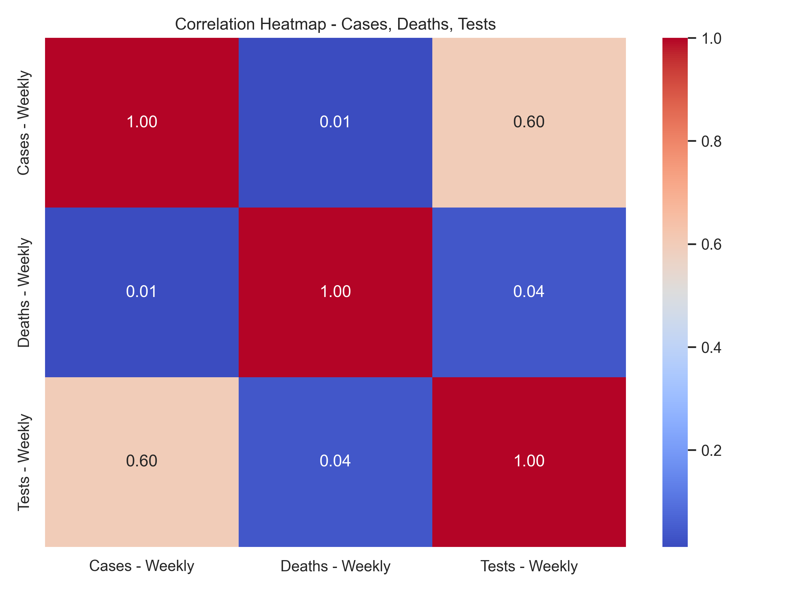

# COVID-19 Data Analysis Project

This project involves cleaning, analyzing, and visualizing COVID-19 data based on ZIP codes and weekly trends.

## Objectives Completed:

### ✅ Objective 1: Data Cleaning and Handling Missing Values
- Removed duplicates
- Median imputation for missing values
- IQR method for outlier removal
- Min-Max normalization for scaling

### ✅ Objective 2: Weekly COVID-19 Trend Analysis
- Line chart for weekly COVID-19 cases, deaths, and tests
- Stacked area chart to visualize comparative trends
- Charts saved as PNGs

### ✅ Objective 3: Correlation Analysis between Cases, Deaths, and Tests
- A heatmap is generated to visualize the correlation between weekly cases, deaths, and tests.
- It was observed that death data in this dataset appears to be largely absent or zero-filled, resulting in negligible correlation with weekly cases or tests.
- Correlation heatmap image is saved in `correlation_heatmap.png`.

---

## Upcoming Objectives:
- ZIP Code Wise Severity Analysis
- Outlier Detection using Boxplots
- Exploratory Data Analysis with Advanced Visualizations